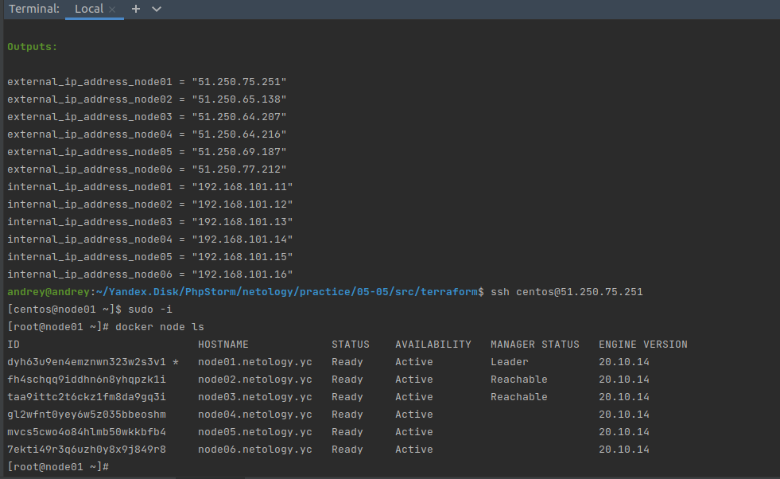
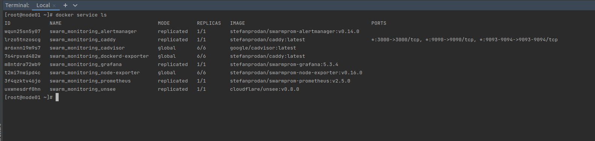

# Домашнее задание к занятию "5.5. Оркестрация кластером Docker контейнеров на примере Docker Swarm"

## Задача 1

Дайте письменые ответы на следующие вопросы:

- В чём отличие режимов работы сервисов в Docker Swarm кластере: replication и global?

```
Для службы в режиме replication задается количество нод, на которых она будет размещена,
global размещается на всех доступных узлах.
```

- Какой алгоритм выбора лидера используется в Docker Swarm кластере?

```
Для выбора лидера используется алгоритм поддержания распределенного консенсуса — Raft.
```

- Что такое Overlay Network?

```
Общий случай логической сети, создаваемой поверх другой сети.
Узлы оверлейной сети могут быть связаны либо физическим соединением, либо логическим, для
которого в основной сети существуют один или несколько соответствующих маршрутов из физических соединений.
Определение стянуто из Вики, но, полагаю, оно описывает суть лучше, чем я сформулировал бы сам.
```


## Задача 2

Создать ваш первый Docker Swarm кластер в Яндекс.Облаке

Для получения зачета, вам необходимо предоставить скриншот из терминала (консоли), с выводом команды:
```
docker node ls
```

<p align="center">
  
</p>

****

## Задача 3

Создать ваш первый, готовый к боевой эксплуатации кластер мониторинга, состоящий из стека микросервисов.

Для получения зачета, вам необходимо предоставить скриншот из терминала (консоли), с выводом команды:
```
docker service ls
```

<p align="center">
  
</p>

****

## Задача 4 (*)

Выполнить на лидере Docker Swarm кластера команду (указанную ниже) и дать письменное описание её функционала, что она делает и зачем она нужна:
```
# см.документацию: https://docs.docker.com/engine/swarm/swarm_manager_locking/
docker swarm update --autolock=true
```

